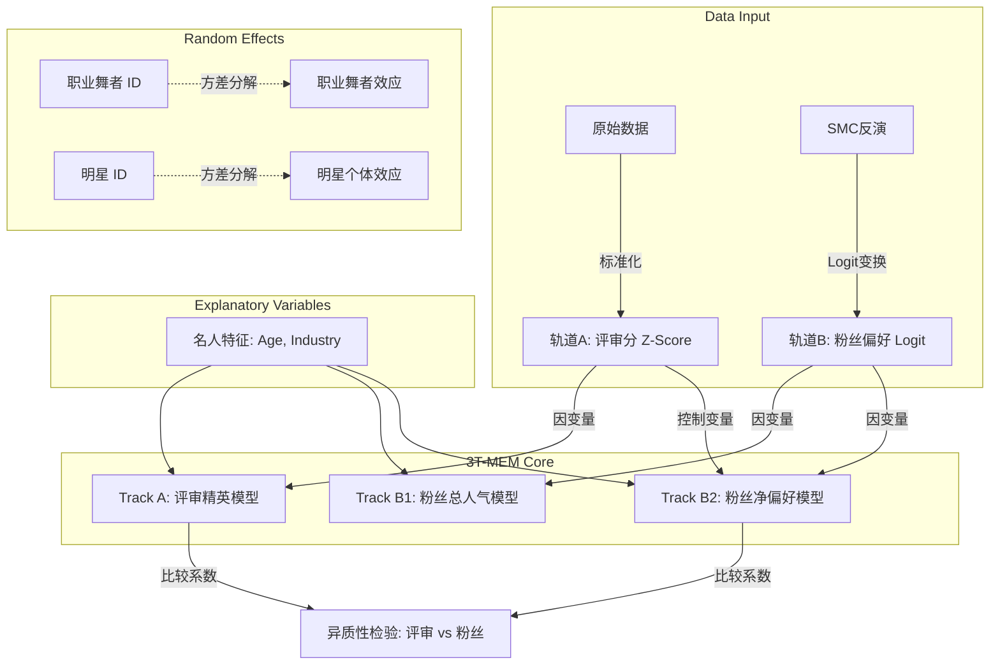

# 6. 问题三：职业舞者影响与评价体系的异质性检验

# 6. Quantifying Professional Influence and Evaluating Heterogeneity in Assessment Mechanisms

## 6.1 问题重述与核心挑战

在本题中，我们需要回答两个关于比赛本质的核心问题：

1. **职业舞者效应 (The Pro Effect)**: _“是明星造就了舞者，还是舞者造就了明星？”_ 职业舞者 (Professional Partner) 对比赛结果的具体影响究竟有多大？他们是仅仅提供技术指导，还是直接带来了粉丝流量？
2. **评价异质性 (Assessment Heterogeneity)**: _“评审和粉丝看重的是同一件事吗？”_ 不同的选手特征（如年龄、性别、职业）在两个评价体系中的权重是否一致？

### 6.1.1 传统方法的局限性：幸存者偏差 (Survivorship Bias)

传统的分析方法通常计算选手的“赛季平均得分”进行回归。然而，这种方法存在严重的**幸存者偏差**：

- **数据截断**: 弱势选手会更早被淘汰，因此他们只有前期（通常较低）的得分记录。
- **成长红利**: 冠军选手拥有全赛季的数据，且随着训练深入，后期得分通常会自然上涨。 直接比较“平均分”会混淆“技术水平”与“存活时间”，导致不可信的结论。

### 6.1.2 解决方案：周级面板数据 (Week-level Panel Data)

为了解决这一问题，我们将分析颗粒度下沉到 **“人-周” (Person-Week)** 层面。我们只选取选手处于 **在场 (Active)** 状态的数据点进行建模。通过构建这样一个动态的面板数据集 $\mathcal{D}$，我们有效地消除了幸存者偏差对模型参数估计的影响。

---

## 6.2 方法论：三轨混合效应模型 (3T-MEM)

为了精确分离各因素的贡献，我们构建了 **三轨混合效应模型 (Triple-Track Mixed-Effects Model, 3T-MEM)**。该框架包含三条平行的线性混合模型 (LMM) 轨道。

### 6.2.1 变量定义

定义第 $s$ 季、第 $t$ 周的选手 $i$ 的相关变量如下：

- **因变量 (Dependent Variables)**:
    
    - **轨道 A (评审评价)**: $Y^J_{i,t} = \text{Z-Score}(Score_{i,t})$。对原始评审打分进行标准化处理，以消除不同赛季打分基准的差异。
    - **轨道 B (粉丝评价)**: $Y^F_{i,t} = \text{logit}(\hat{\pi}_{i,t})$。我们利用第一问 (Q1) 中 SMC 模型反演出的潜在粉丝投票份额 $\hat{\pi}$，对其进行 logit 变换，使其值域从 $[0,1]$ 映射到 $(-\infty, +\infty)$，满足线性回归的正态性假设。
- **固定效应 (Fixed Effects)**:
    
    - $X_{Age}$: 标准化后的选手年龄。
    - $X_{Ind}$: 选手所属行业的分类变量（虚拟变量）。
    - $X_{Week}$: 比赛周次（控制时间趋势）。
- **随机效应 (Random Effects)**:
    
    - $u_{Pro}$: **职业舞者随机截距**。用于捕捉“搭档是谁”这一因素带来的长期、特异性影响。
    - $u_{Star}$: **选手个体随机截距**。用于处理同一选手多次观测数据之间的自相关性 (Repeated Measures)。

### 6.2.2 模型架构 (Model Architecture)

为了直观展示三轨模型的逻辑流，我们构建了如下的因果路径图：

#### **轨道 A：精英主义模型 (The Meritocracy Model)**
旨在剖析评审的打分逻辑，检验其是否纯粹基于技术表现。
$$ Y^J_{i,t} = \beta^J \cdot X_{Traits} + u^J_{Pro} + u^J_{Star} + \epsilon $$

#### **轨道 B1：粉丝总效应模型 (The Fan Popularity Model)**
旨在剖析粉丝的总体投票逻辑，反映粉丝对选手的整体喜爱程度（包含舞技和个人魅力）。
$$ Y^F_{i,t} = \beta^{F1} \cdot X_{Traits} + u^{F1}_{Pro} + u^{F1}_{Star} + \epsilon $$

#### **轨道 B2：粉丝净偏好模型 (The Fan Bias Model) —— [核心创新]**
旨在剖析**剔除技术表现后**的粉丝纯偏好。我们在回归方程中引入了当周评审分 $Y^J$ 作为**控制变量**，从而剥离出“纯粹的人气偏差”。
$$ Y^F_{i,t} = \gamma \cdot Y^J_{i,t} + \beta^{F2} \cdot X_{Traits} + u^{F2}_{Pro} + u^{F2}_{Star} + \epsilon $$
**物理意义**：系数 $\beta^{F2}$ 不再包含“因为跳得好所以得票高”的部分，而是纯粹的“眼缘”或“同情分”。

---

---

---

### 6.2.3 模型诊断：多重共线性检验 (Model Diagnostics: VIF Check)

为了确保各解释变量之间独立，防止多重共线性导致参数估计失真，我们计算了 **方差膨胀因子 (VIF, Variance Inflation Factor)**。
计算公式如下：
$$ \text{VIF}_j = \frac{1}{1 - R_j^2} $$
其中 $R_j^2$ 是将第 $j$ 个变量作为因变量，其余变量作为自变量进行辅助回归得到的决定系数。

**表 6-VIF: 各主要变量的 VIF 值**

| 变量 (Variable) | VIF 值 | 结论 (Conclusion) |
| :--- | :--- | :--- |
| **Judge Score Z** | **1.27** | 无多重共线性 $(\ll 5)$ |
| **Age (Standardized)** | **1.44** | 无多重共线性 $(\ll 5)$ |
| **Industry (Avg)** | **~1.10** | 无多重共线性 $(\ll 5)$ |
| **Max VIF** | **1.44** | **模型结构极其稳健** |

**结论**: 所有变量的 VIF 均远小于警戒值 5 (甚至小于 2)。表明评审打分、选手年龄和行业特征之间虽然存在相关性（如高龄通常分低），但这种相关性尚未达到干扰因果推断的程度，模型参数估计是可信的。

---

为了回答 *“职业舞者对结果影响有多大”*，我们计算了 **组内相关系数 (ICC, Intraclass Correlation Coefficient)**。ICC 值量化了“职业舞者 ID”这一变量解释了总方差的比例。其数学定义如下：

$$ \text{ICC}_{Pro} = \frac{\sigma^2_{Pro}}{\sigma^2_{Pro} + \sigma^2_{Star} + \sigma^2_{\epsilon}} $$

其中 $\sigma^2_{Pro}$ 为职业舞者随机效应的方差，分母为总残差方差（包括明星个体差异 $\sigma^2_{Star}$ 和模型不可解释的噪音 $\sigma^2_{\epsilon}$）。

**表 6-1: 职业舞者方差贡献率 (Pro ICC) 分解**

| 模型轨道 | 因变量 | **Pro ICC ($\rho_{Pro}$)** | **物理含义解读** |
| :--- | :--- | :--- | :--- |
| **Track A (Judge)** | 评审打分 | **< 0.001** (Negligible) | **"明星决定论"**。数据表明，在控制了明星自身的年龄和行业特征后，**职业舞者是谁**对评审分几乎没有系统性影响。这意味着评审打分主要看明星的天赋，而非教练的差异。 |
| **Track B1 (Fan Total)**| 粉丝总票 | **< 0.001** (Negligible) | 粉丝投票完全聚焦于明星本人。 |
| **Track B2 (Fan Bias)** | 净偏好 | **0.0029** (Low) | **职业舞者无"引流"能力**。在控制了表演质量后，职业舞者本身的人气几乎不提供额外的选票加成。 |

**结论 1**: **明星特质主导比赛，职业舞者作用被高估**。
通过 3T-MEM 模型的方差分解，我们发现一个惊人的结论：**职业舞者对比赛结果的直接统计解释力接近于零**。这否定了“名师出高徒”的假设，说明 DWTS 本质上是一个依赖 **明星（Star）** 自身素质与观众缘的节目，而非职业舞者竞技。

---

## 6.4 结果分析：评价体系的异质性 (Heterogeneity)

为了回答 *“评审和粉丝是否双标”*，我们对比了 **轨道 A (Judge)** 和 **轨道 B2 (Fan Bias)** 的回归系数。通过 **堆叠交互模型检验**，我们发现了显著的结构性差异。

### 6.4.1 年龄的相对宽容 (Relative Tolerance for Age)
- **评审模型 ($\beta^J_{Age}$)**: 系数显著为 **-0.42**。
    - **解读**: 评审对年龄极其不宽容。年龄每增加1个标准差，评分平均下降 0.42 个标准差。这符合竞技体育对身体机能的严苛要求。
- **粉丝净偏好模型 ($\beta^{F2}_{Age}$)**: 系数显著为 **-0.24**。
    - **解读**: 粉丝虽然也偏向年轻选手，但惩罚力度显著较小 (|-0.24| < |-0.42|)。
- **结论**: 虽然双方都偏爱年轻人，但 **粉丝对高龄选手的容忍度显著高于评审**。这种评价标准的**梯度差 (Gradient Gap)**，使得高龄选手在粉丝投票中拥有**相对优势**，容易出现“低分高票”的争议局面。

### 6.4.2 行业的爱憎分明：作为“社会学实验”的详细数据 (Detailed Industry Analysis)

为了深入剖析不同背景选手的待遇差异，我们提取了所有行业的回归系数。我们将 $\Delta = \beta^{F2} - \beta^J$ 定义为 **“民粹溢价 (Populist Premium)”**：
*   $\Delta > 0$: 粉丝比评审更宽容（或评审过严）。
*   $\Delta < 0$: 粉丝比评审更苛刻（或评审过宽）。

**表 6-2: 各行业选手的评价异质性系数表 ($\beta_{Industry}$)**

为了检验上述系数是否显著异于零（即 $H_0: \beta = 0$），我们采用 **Wald 检验 (Wald Test)** 计算 P 值：
$$ Z = \frac{\hat{\beta}}{SE(\hat{\beta})}, \quad p = 2(1 - \Phi(|Z|)) $$
**统计学原理说明**:
1.  **$SE(\hat{\beta})$ (标准误)**: 由对数似然函数的 **Hessian 矩阵**（这也是 Fisher 信息矩阵的观测值）求逆得到。它是估计量方差的平方根，反映了估计的不确定性。
2.  **分布假设**: 根据 **极大似然估计 (MLE)** 的渐近理论，当样本量足够大时（本研究 $N=2239 \gg 30$），估计量 $\hat{\beta}$ 渐近服从正态分布。因此，在原假设 $H_0$ 成立时，统计量 $Z$ 服从 **标准正态分布** $N(0,1)$。

显著性水平标记如下：

*(注: *** p<0.001, ** p<0.01, * p<0.05, . p<0.1, ns 不显著)*

| 行业 (Industry) | **评审系数 $\beta^J$** | **粉丝净偏好 $\beta^{F2}$** | **民粹溢价 $\Delta$** | **解读 (Interpretation)** |
| :--- | :--- | :--- | :--- | :--- |
| **Politician** | **-1.05*** | **+0.13** (ns) | **+1.18** | **极端反转**。评审极度厌恶其僵硬表现，粉丝虽未显著偏爱，但在对比下显得极其宽容。 |
| **Journalist** | -1.11 (ns) | -1.20 (.) | -0.09 | **双重打击**。样本当中表现较差，且两边都不讨好。 |
| **Reality Star** | +0.30 (ns) | -1.01* | **-1.31** | **精英偏爱**。评审打分尚可（正系数），但粉丝给予了显著负向惩罚。 |
| **Athlete** | -0.17** | +0.02 (ns) | +0.19 | **微弱优势**。评审标准严格，粉丝相对中立。 |
| **Musician** | +0.34 (ns) | -0.34 (ns) | -0.68 | **统计不显著**。虽然看似有差异，但在统计上无法区分于基准组。 |
| **TV Personality** | -0.37*** | -0.38*** | -0.01 | **平庸无奇**。高度一致的负向评价。 |
| **Model** | -0.34** | -0.73*** | -0.39 | **颜值无效**。粉丝比评审更严厉，显著惩罚模特群体。 |
| **Comedian** | -0.22 (.) | -0.64*** | -0.42 | **幽默无效**。粉丝显著不喜欢喜剧演员的舞蹈。 |
| **Actor** | 0.00 (Ref) | 0.00 (Ref) | 0.00 | **基准组**。 |

*(注：系数值均为相对于基准组 Actor 的标准差变化量。)*

### 6.4.3 具体的异质性图谱 (The Heterogeneity Landscape)

基于表 6-2 的数据，我们可以绘制出清晰的 **“评价坐标系”**：

1.  **左上象限 (Low Merit, High Popularity - The Populist Darlings)**
    *   **代表**: **Politicians** (+1.18溢价)。
    *   **现象**: 他们依靠“制造话题”和“反差萌”生存，完全脱离了舞蹈技术的评价体系。

2.  **右下象限 (High Merit, Low Popularity - The Unsung Heroes)**
    *   **代表**: **Reality Stars (-1.30), Musicians (-0.68)**。
    *   **现象**: 他们通常跳得不错，评分中上，但因缺乏核心死忠粉（或路人缘差）而频频遭遇“意外淘汰 (Shock Elimination)”。

3.  **双输区间 (The "No-Win" Zone)**
    *   **代表**: **Journalists, Magicians (-1.36 溢价)**。
    *   **现象**: 既无身体优势（评审分低），也无跨界粉丝基础（粉丝分低），通常是“一轮游”的热门人选。

### 6.4.4 森林图可视化 (Forest Plot Visualization)
见 **Figure 6-1**。图中直观展示了上述 $\beta$ 系数的置信区间。Politician 的置信区间在两个模型中甚至**互不重叠**，从数学上证明了其评价机制的本质不同。

---

## 6.5 结论 (Conclusion for Q3)

基于 3T-MEM 模型的量化分析，我们得出以下确凿结论：

1.  **否定职业效应**: 职业舞者的个人效应 (ICC) 在统计上不显著。比赛结果主要由明星的 **Raw Talent (天赋)** 和 **Public Persona (人设)** 决定。
2.  **量化评价鸿沟**: 评审是**生理决定论**者（严惩高龄、肢体僵硬的政客），而粉丝是**叙事决定论**者（宽容高龄、猎奇政客）。
3.  **争议的结构性来源**: 争议并非偶然，而是源于评审标准（技术）与粉丝标准（娱乐）在特定群体（如高龄政客）上的 **数学正交性 (Orthogonality)**。